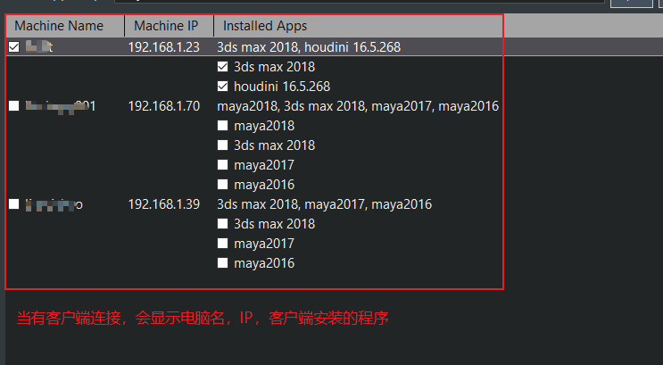
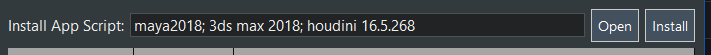
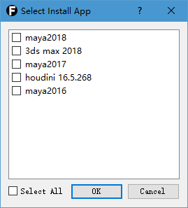
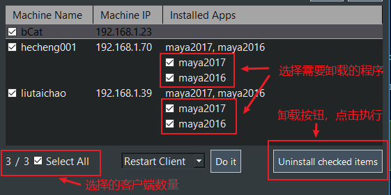
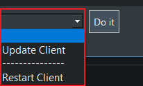
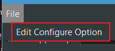
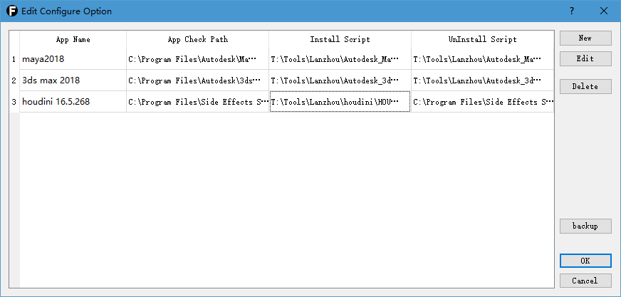
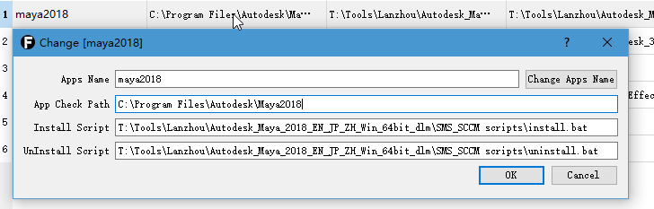
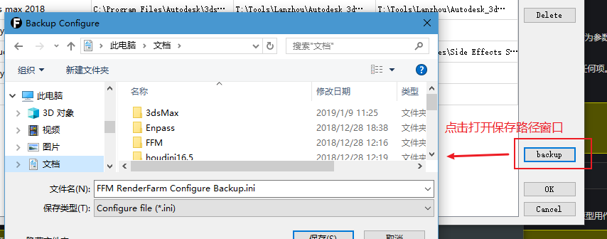

# 使用说明

### 一、基本配置

当启动服务器后，服务器会在C:\User目录下创建一个FFM文件夹，包含一个配置文件，一个日志文件，提供修改配置和查看日志。

**配置文件**：当配置文件出现变更路径等问题时，可以修改内容。

**日志文件**：输出保存服务器日常使用状态和异常。

双击服务器启动文件便可以启动，或者使用命令行启动，服务器会保留命令行窗口，实时输出状态。

 
### 二、管理客户端

启动服务器后，自动开始监听，等待客户端连接，IP和端口号自动保存在配置文件。

可以通过客户端电脑名称前面的复选框选择客户端，也可以通过双击展开安装的程序，同时可以单独选择已安装的程序。

- 选择电脑，用于安装软件，和其他操作电脑指令
- 选择已安装程序，用于卸载指定软件（选择软件会自动关联客户端）

可以通过下面的全选，来选择所有电脑。

如图，可以全选和全不选，同时服务器会显示已选择客户端的数量。

 
***选择好需要管理的客户端之后，可以选择具体指令。***

- **安装程序**

    
    
    1、点击打开按钮；
    
    
    
    2、选择希望安装的程序，然后点击确定，选择的程序名称会显示在“Install App Script”显示栏中；
    
    3、点击安装按钮，服务器会给选中的客户端电脑发送安装指令，客户端开始安装指定程序。
    
- **卸载程序**
    
    
    
    1、先选择需要卸载的程序（注意：每个客户端需要单独选择）；
    
    2、点击卸载按钮，服务器会发送卸载指令。

- **其他指令**

    
    
    1、选择需要执行的客户端名称；
    
    2、在服务器窗口下方的下拉选项中选择需要执行的指令名称；
    
    3、点击执行按钮，服务器会发送相应指令。

 
### 三、配置文件管理

- **打开配置文件管理界面**

    选择菜单栏中的“文件(File)” -> “编辑配置选项(Edit Configure Option)”

    

- **管理配置文件**

    
    
    界面中会显示所有当前已配置的“程序检测路径”、“安装脚本”、“卸载脚本”。

    - **程序检测路径**：程序安装的路径，客户端会根据提供的路径检测该程序是否安装。当添加程序时，需要手动检测；

    - **安装脚本、卸载脚本**：提供安装、卸载功能，*具体设置方法参照脚本制作说明*。

    **新建(New)**：创建一行新程序指令；
    
    **编辑(Edit)**：选择一行以开始编辑该行，此功能同样适用于双击指定行，会打开该行信息；
    
     - 
     - 默认情况下Apps Name是不可编辑，如果需要改变程序名，点击右侧“更改程序名(Change Apps Name)”即可；
     - 修改完成后点击确认即可。
    
    **删除(Delete)**：选择一行删除；
    
    **备份(Backup)**:
    
     - 
     - 保存后会保存到指定位置，默认保存名会包含当前时间。
    
    

