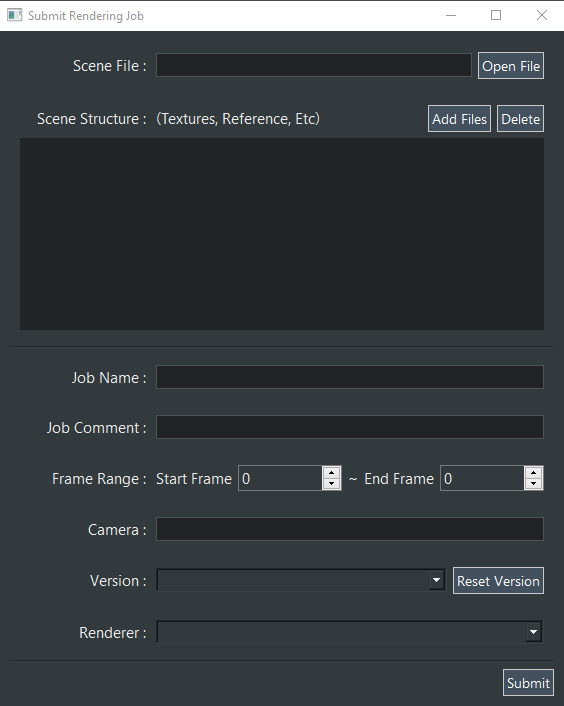
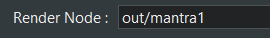
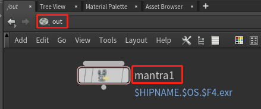
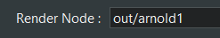
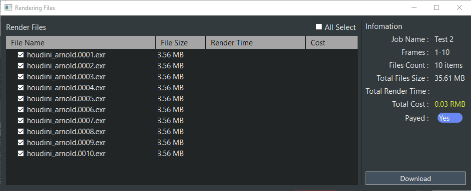
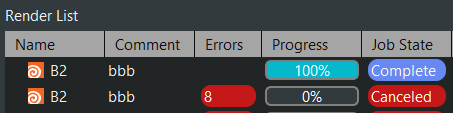
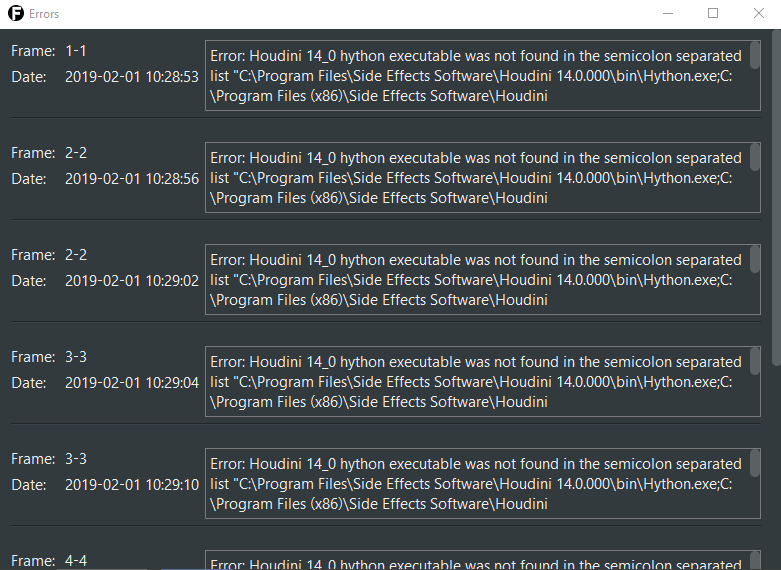

FFM Rendering Service Help
==========================

### 1. Login
 > You can log in using the ID and password given by the administrator.
 > 
 >  If you no have an ID with Password, please contact to administrator.
 > 
 > **Email : liuxiangdong@ffmilmco.com**
 >
 > **WeChat : l_1386**
 >
 > **Phone : 15383120715** 

### 2. Submit Job
> 
>
> Select the **Tools > Submit Job**

> 
>
> Scene File : Choose your work scene file. (E.g : Maya, 3DsMax, Houdini etc.)  
>
> Scene Structure : Add texture or reference files.
>
> Job Name : The name of your render job.
>
> Job Comment : A brief explanation for your job and anything can write what you say.
>
> Frame Range : The range of start with end frames. 
Make sure fill out into the forms what frames in your scene, the end frame should to less than start frame. 
>
> Version : The specific version for software when you work for used that.
If not displayed versions items in the drop down forms just push the button of "Reset Version" again.
And still not displayed that try to contact with Administrator.

> * #### MAYA
> Camera : The name of camera object in your scene that you want render.
> 
> Renderer : The name of render plugin when you work for used that.

> * #### 3DsMax
> Camera : The name of camera object in your scene that you want render.

> * #### Houdini
> Render Node : The name of output node.
>
> 
> 
> 
> 
> 
> 
> 
> 

### 3. Re Submit Job
> You can select anything from the render list that is already finished render job and resubmit it.
>
> The submit forms same with normal submit forms. Just press the submit button or fix the submit information after do it. 

### 4. Cancel Job
> If some render job is working on rendering you can cancel it.
>
> The render job just stop immediately.

### 5. Payment
> If your render job finished and you want download this files, you should pay first.
> 
> Our payment process follow to manually now. 
>
> So you can call to Administrator then say to him what you want pay for render job.
>
> And finish the your pay then the Administrator change to payment state to **"Yes"**  
>

### 6. Show Render Files
> Select any render job item on list, press the **"Show Render Files"** right mouse button click or 
**Main Menu > Tools > Show Render Files**.
>
> 
>
> If you accomplish for paid you can use the download button.
>
> The action of download files that only working for checked files. 

### 7. Show Errors
> If render scene has problems, the count of errors column in the list increases.  
>
> And you can cancel job yourself.
>
> 
>
> Select any render job that has problems, press the **"Show Errors"** right mouse button click or 
**Main Menu > Tools > Show Errors**.
>
> 
>
> The pop-up window shows more information about detail of errors.

