## FFM Render Manager Monitor 说明文档
FFM Render Manager Monitor（以下简称RMM）是管理渲染客户端的服务器界面软件。

------
#### 主界面：
主界面中可以显示当前连接的客户信息。

右键用户可以显示用户主目录，显示用户信息，显示用户任务信息，更新用户列表等。
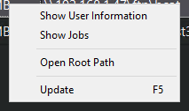

#### 菜单：
提供管理用户和配置属性。
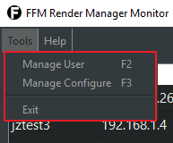

##### - 用户管理：
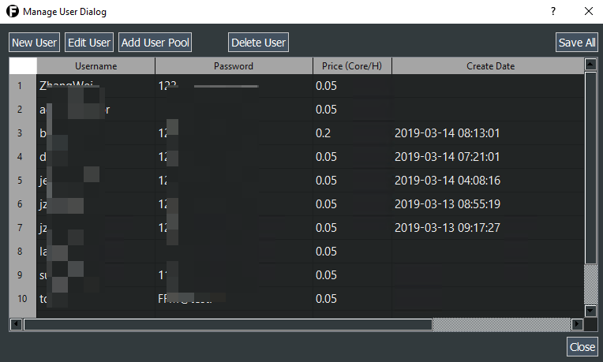
可以新建用户，查看用户信息，修改用户信息，删除用户，管理用户池等。

在用户管理页面，双击用户，可以修改用户信息。
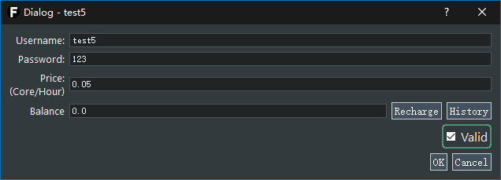

管理员可以修改用户密码，单价和用户有效性的信息。
同时管理员可以在本页面给用户充值和查看记录。
点击Recharge按钮进行充值。
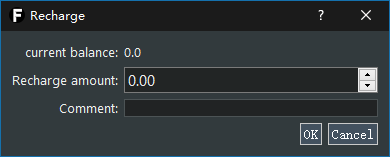

点击History按钮，可以查看充值的历史记录。
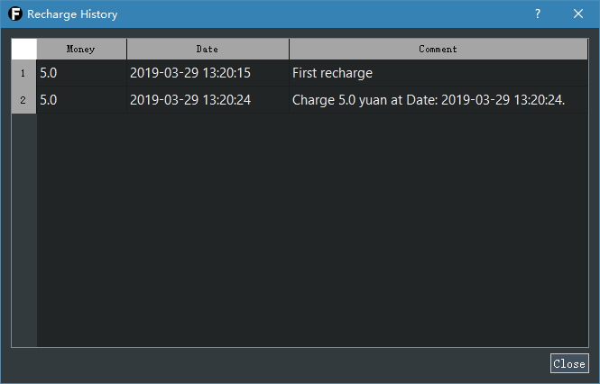

##### - 配置管理：
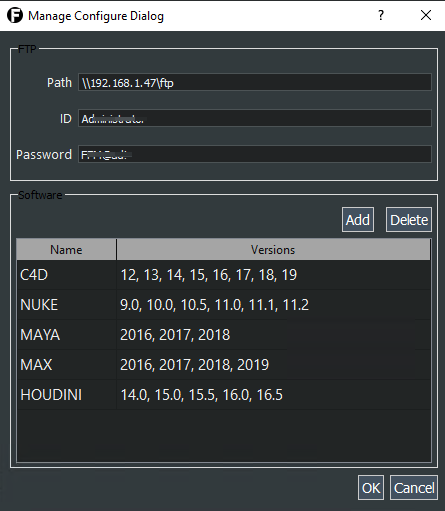
可以管理FTP、服务软件版本信息等。

#### 任务界面：
双击用户，可以显示用户的Job任务信息。
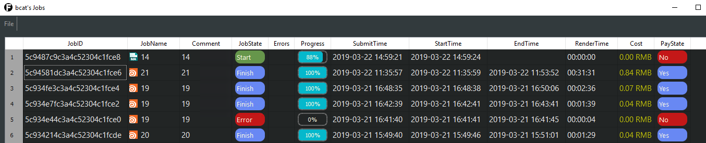

Job任务显示界面可以显示任务状态，进度，起止时间等信息。

双击Job任务可以显示当前任务的详细信息。
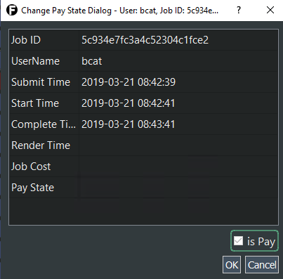

右键点击Job任务，可以显示任务输出文件路径和错误信息。
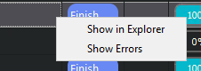
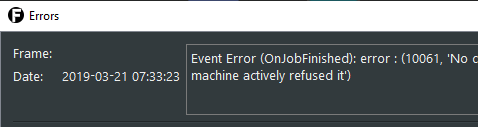

